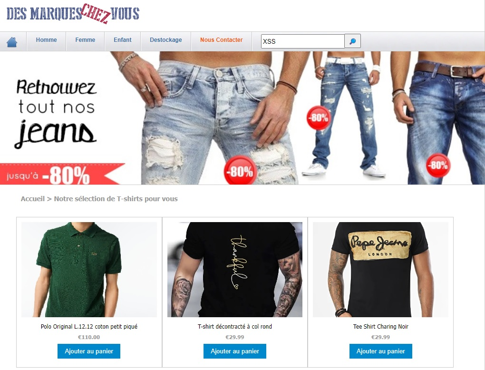

# CTF Web Client - XSS REFLECTED

## Présentation du CTF 
**ID** 19 dans **les CTFs de Cyrhades**

Récupérez le FLAG de validation en exploitant une faille XSS Reflected.

Dans ce challenge l'objectif est de récupérer les cookies de connexion du service technique 
et de se connecter avec pour obtenir le flag, vous n'aurez pas à chercher longtemps.

## Aperçu

-----------

## Installation manuel
Vous n'utilisez pas l'application **les CTFs de Cyrhades** ? C'est dommage !
Mais voici comment installer ce CTF manuellement :

> git clone https://github.com/Hack-Oeil/XSS_REFLECTED.git

> cd XSS_REFLECTED && docker compose up

